# Kata Motor codigo legado 

---

## Enlaces importantes 📌 

| Recurso | Link |
|--------|------|
| **Repositorio GitHub** | https://github.com/mesa963/kata_motor |
| **Documentación Api** | https://motorcodigolegado.up.railway.app/swagger-ui/index.html |
| **Demo funcional** | https://motorcodigolegado.up.railway.app/ |

---

## Arquitectura

```mermaid
---

---
flowchart TD
    A([Usuario]) --> B([Navegador Web])
    
    subgraph Railway [Plataforma Railway]

        B --> C[Frontend: Angular]
        C -- "Petición REST" --> D[Backend: Spring Boot]
        
        subgraph Motor [Motor Reglas]
            D --> E[API Controller]
            E --> F[Servicio Migración]
            F --> G[Reglas]
        end
        
        G -. "Transforma" .-> F
        F -. "Respuesta JSON" .-> C
    end
```

## Flujo Motor legado
---

