# Kata Motor codigo legado 

---

## Enlaces importantes 📌 

| Recurso | Link |
|--------|------|
| **Repositorio GitHub** | https://github.com/mesa963/kata_motor |
| **Documentación Api** | https://motorcodigolegado.up.railway.app/swagger-ui/index.html |
| **Demo funcional** | https://motorcodigolegado.up.railway.app/ |

---

## Arquitectura

```mermaid
flowchart TD
    A([Usuario]) --> B([Navegador Web])
    B --> C[Frontend: Angular]
    C -- "Petición REST" --> D[Backend: Spring Boot]
    D --> E[API Controller]
    E --> F[Servicio Migración]
    F --> G[Reglas]
    G -. "Transforma" .-> F
    F -. "Respuesta JSON" .-> C
```

## Flujo Motor legado
---

---
## Despliegue On-Premise
---

-Balanceador de Carga: Gestionado a través del orquestador F5 del banco para distribuir el tráfico y asegurar alta disponibilidad.

-Servidores de Aplicación (CI/CD): El despliegue está automatizado mediante GitHub Actions. Al realizar un push o merge a la rama master, los pipelines ejecutan la compilación y el paso a los servidores. Nota: Los servidores destino requieren Node.js y Java JDK 17 instalados.

-Almacenamiento y Seguridad: Soportado por una base de datos Oracle (On-Premise o Cloud). Para garantizar la seguridad, las credenciales se inyectarán a través del DataSource del servidor o mediante variables de entorno, quedando bajo la custodia exclusiva del área responsable.

---
## Despliegue Cloud (AWS)
---
-Amazon API Gateway Se implementa como punto de entrada único para centralizar la configuración de CORS y desacoplar la interfaz de Angular del motor en Spring Boot, facilitando la gestión de tráfico y seguridad perimetral.

-Amazon ECS con AWS Fargate: El proyecto para esta kata se planteo un solo artefacto por facilidad de despliegue (Angular integrado en Spring Boot), se despliega mediante una imagen Docker. Se utiliza Fargate para eliminar la gestión de servidores físicos, delegando la disponibilidad y el escalado al servicio administrado de AWS.

-GitHub Actions podemos automatizar el ciclo de vida completo. Cada push o merge a la rama principal dispara el pipeline de compilación, la generación de la imagen de Docker y el push a Amazon ECR, garantizando un despliegue continuo.

-Amazon RDS (Oracle) o DynamoDB: La elección del motor de base de datos se define por la naturaleza de la data; en este caso simulando la nesecitad de guardar los reportes por ejecucion configuraria una DynamoDB para un almacenamiento NoSQL de alto rendimiento y baja latencia.

-Amazon CloudWatch con esta  herramienta se realizaria la captura de log y monitoreo técnico.

---
## Riesgos de seguridad
---
-Inyección de Código Malicioso : El motor solo procesa texto plano y las reglas están aisladas; no se utiliza eval() ni se compila código en tiempo de ejecución de forma dinámica.

-Acceso no Autorizado : Implementar una politica restrictiva de cors y autenticacion atravez de API-keys.

-Inyección SQL : Al utilizar Spring Data JPA, la aplicación emplea automáticamente consultas parametrizadas. Esto asegura que el motor de la base de datos trate la entrada del usuario estrictamente como texto plano y nunca como código ejecutable.

